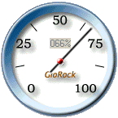



## CPU Usage Pro 2

### Description

A new CPU usage graphic meter like Vista Style.

Adding speed index meter bitmap with machine code

antialias rotating by Robert Rayment & Buggy class

modified by me.

Now you can set timer interval with righ button down

and the value is saved in the registry.

Win98, ME, NT & XP supported.

Updated 2012, now it does works in Win7 too...
 
### More Info
 

             |
---                |---
**Submitted On**   |2012-05-09 15:58:22
**By**             |[GioRock](https://github.com/Planet-Source-Code/PSCIndex/blob/master/ByAuthor/giorock.md)
**Level**          |Advanced
**User Rating**    |5.0 (45 globes from 9 users)
**Compatibility**  |VB 6\.0
**Category**       |[Windows System Services](https://github.com/Planet-Source-Code/PSCIndex/blob/master/ByCategory/windows-system-services__1-35.md)
**World**          |[Visual Basic](https://github.com/Planet-Source-Code/PSCIndex/blob/master/ByWorld/visual-basic.md)
**Archive File**   |[CPU\_Usage\_222369592012\.zip](https://github.com/Planet-Source-Code/giorock-cpu-usage-pro-2__1-70834/archive/master.zip)

